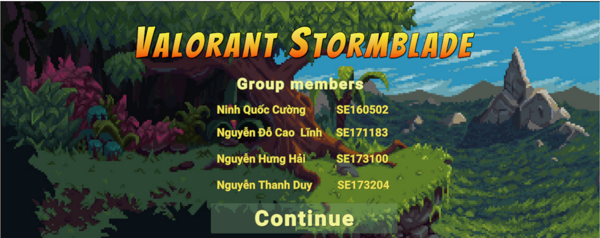
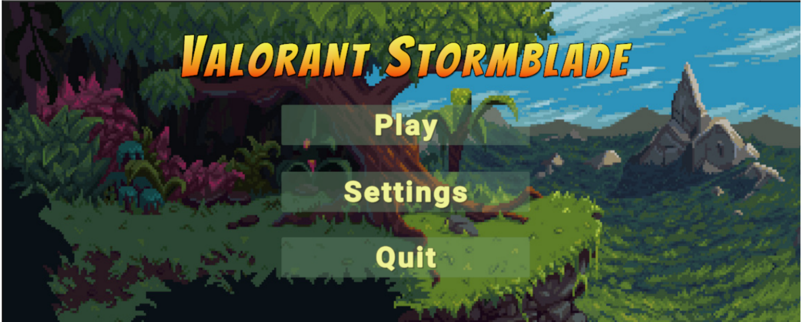
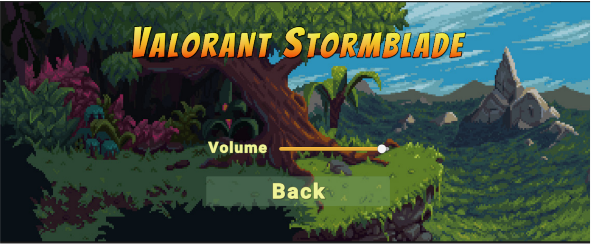
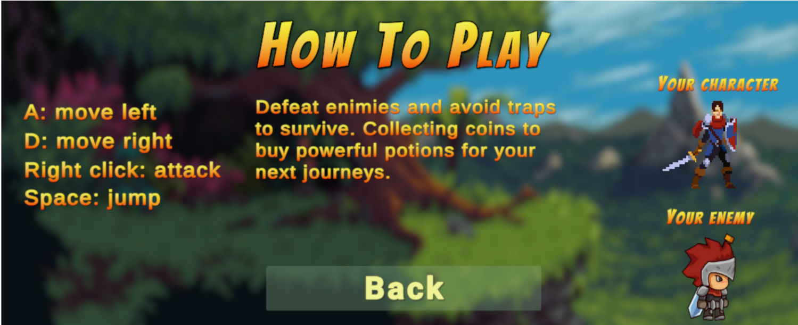
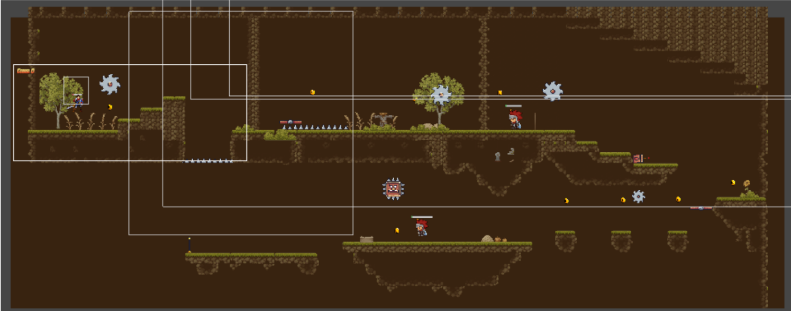
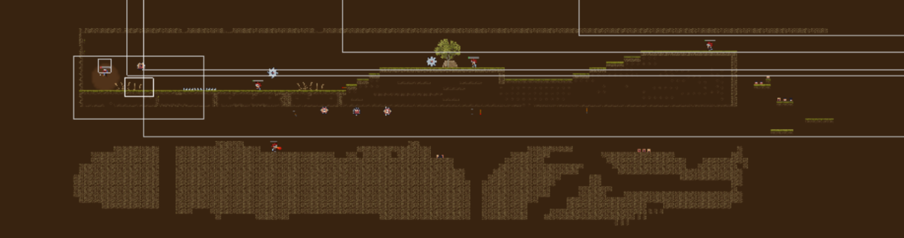
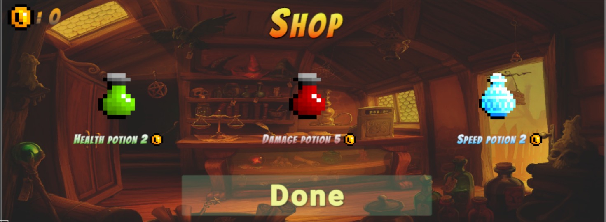
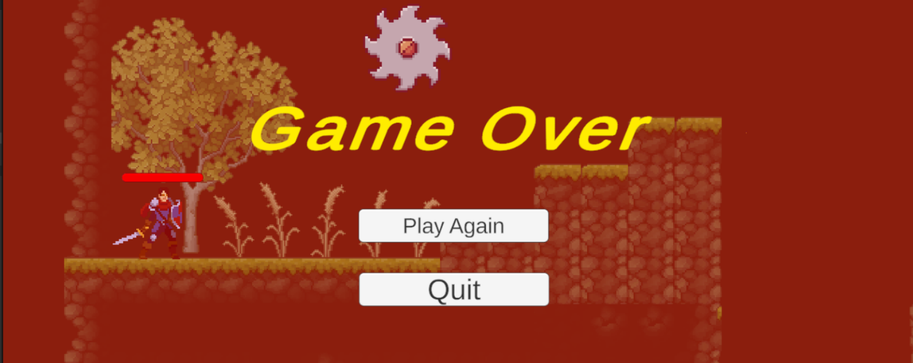
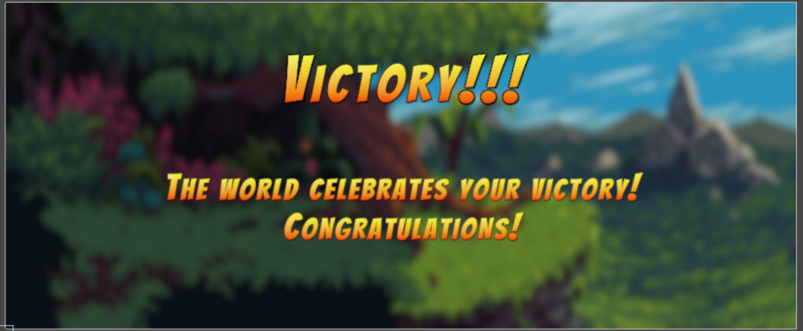

## Game Introduction

Welcome to Valoran Stormblade, an exciting adventure game where players embark on a journey filled with perilous challenges and thrilling encounters. In this game, you will delve into a world of mystery and danger, navigating through multiple levels teeming with formidable bosses, cunning traps, and valuable rewards.

### How to Play

- Control the character using WASD keys or the arrow keys to conquer each level.
- Collect coins to purchase potions after each level.
- Attack encounters to conquer each level.
- Move strategically to bypass traps and challenges.
- After every level, a shop will appear for characters to purchase potions which can upgrade the character’s abilities.
- After conquering each level, the player can claim their rewards.

**Editor Version:** 2022.3.16f1  
**Platform:** Desktop  
**Resolution:** 1920 x 1080

**Libraries Needed for Project:**
- Cinemachine
- TextMeshPro
- Input System 
- URP with 2D Renderer
- Universal RP

**Build Settings:**
- Includes necessary scenes (Start Menu Scene, How to Play Scene, Setting Scene, Level 1 Scene, Level 2 Scene, Shop Potion Scene, Victory Scene, and Game Over Scene)
- Build: .exe

**Screen Design**

**References**
https://assetstore.unity.com/packages/2d/characters/hero-knight-pixel-art-165188
https://assetstore.unity.com/packages/2d/environments/pixel-art-platformer-village-props-166114
https://assetstore.unity.com/packages/2d/gui/icons/2d-pixel-item-asset-pack-99645
https://assetstore.unity.com/packages/2d/characters/dragon-warrior-free-93896

